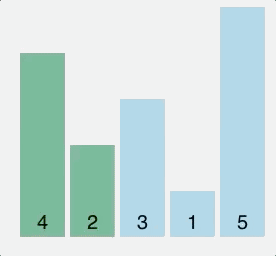

# Algorithms

## Bubble sort
Bubble sort compares each pair of elements in a list and swaps them if they are out of order until the list is sorted. Like insertion sort, bubble sort is a comparison algorithm and runs in O(n²) time, making it an inefficient algorithm for larger lists.

### Visual


### Code:
```javascript
function bubbleSort(arr) {
    var done = false;
  
    while(!done){
      done = true;
        for (var i = 0; i < arr.length - 1; i++) {
            if (arr[i] > arr[i+1]) {
                var temp = arr[i];
                arr[i] = arr[i+1];
                arr[i+1] = temp;
                done = false;
            }
        }
    }
    return arr;
}

bubbleSort([2, 6, 1, 9, 3, 8, 5, 4, 7]);
```

## Selection sort
A sort algorithm that repeatedly searches remaining items to find the least one and moves it to its final location. The run time is O(n²), where n is the number of elements. The number of swaps is O(n).

### Visual


### Code:
```javascript
function selectionSort(arr){
    for (let i = 0; i < arr.length; i++) {
        let min = i;
        for (let j = i + 1; j < arr.length; j++) {
            if (arr[min] > arr[j]) {
                min = j;
            }
        }
        if (min !== i) {
            let tmp = arr[i];
            arr[i] = arr[min];
            arr[min] = tmp;
        }
    }
    return arr;
}

selectionSort([1, 5, 6, 2, 3, 8, 4, 7, 9,]);
```
